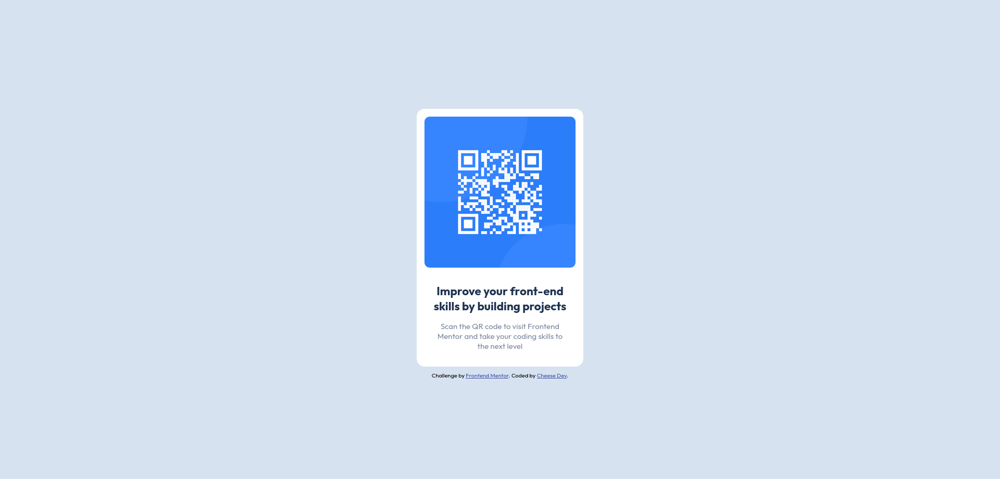

# Frontend Mentor - QR code component solution

This is a solution to the [QR code component challenge on Frontend Mentor](https://www.frontendmentor.io/challenges/qr-code-component-iux_sIO_H). Frontend Mentor challenges help you improve your coding skills by building realistic projects. 

## Table of contents

- [Frontend Mentor - QR code component solution](#frontend-mentor---qr-code-component-solution)
  - [Table of contents](#table-of-contents)
  - [Overview](#overview)
    - [Screenshot](#screenshot)
    - [Links](#links)
  - [My process](#my-process)
    - [Built with](#built-with)
    - [What I learned](#what-i-learned)
  - [Author](#author)
  - [Acknowledgments](#acknowledgments)

## Overview

### Screenshot

### Links

- Solution URL: [Github repository](https://github.com/heloiseouvry/frontend-mentor-qr-code)
- Live Site URL: [Portfolio](http://www.cheesedev.com/frontend-mentor/qr-code)

## My process

### Built with

- Semantic HTML5 markup
- Flexbox

### What I learned

It's the first challenge I've done from Frontend Mentor. It was an easy one that helped me review some basics.

## Author

- Website - [Cheese Dev](http://www.cheesedev.com)
- Frontend Mentor - [@heloiseouvry](https://www.frontendmentor.io/profile/heloiseouvry)
- Github - [@heloiseouvry](https://github.com/heloiseouvry)

## Acknowledgments

Thanks to [Frontend Mentor](https://www.frontendmentor.io) for sharing those challenges!
